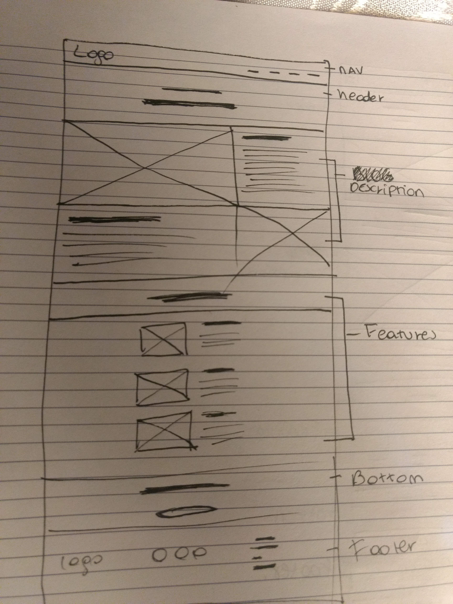

## 2 Requerimientos Generales 

- Web tipo Landing Page / Corporativo 
- Barra de navegacion y footer
- 5 secciones 
 - Header 
 - Reseña de su historia / Description
 - Procedencia de sus productos / Description
 - Mostrar las personas que trabajan cosechando sus verduras / Features
 - Boton de venta / Bottom

## Requerimientos Especificos 

- Fuentes 
 - Raleway-Bold 
 - Raleway-Extralight
 - Open Sans 

- Grilla 
 - Bootstrap 

- Colores de acuerdo a la guia de estilos 
 - #E56353 
 - #686963 
 - #707070 
 - #fafafa 
 - #ffffff

- Iconos grises con background blanco 
 - Usar repositorio Font Awesome  

## Requisitos Visuales 

- Layout 
 - Bootstrap 

-Fuentes 
 - Google Fonts 

- Titulos 
 - Raleway Bold 
 - Raleway ExtraLight  

- Parrafos 
 - Open Sans 

- Imagenes
 - Dentro de la carpeta 

- Iconos  
 - Buscar iconos en Font awesome 

- Colores 
 - Fuente: #707070 
 - Barra de navegación: #FFFFFF
 - Header: Fondo #E56353 Fuentes #ffffff 
 - Descripcion de la empresa: Imagen + Fondo #707070 Fuente #FFFFFF
 - Procedencia de los productos: Imagenes + Fondo #ffffff
 - Personas que trabajan cosechando: Background #E56353 Fuente #ffffff imagen de los cosechadores
 - Boton de venta: Fondo #E56353 Fuente #ffffff boton background #ffffff fuente #707070  

## Imagenes de los scketch

## Clases según BEM 

navbar_tiatomate

header_tiatomate
 - header_tiatomate_fontlight
 - header_tiatomate_fontbold 

description 
 - description_col_1 
  - description_img1
  - description_font1

 - description_col_2
  - description_font2
  - description_img2

features 
 - features_1
  - features_img
  - features_text

 - features_2
  - features_img
  - features_text

bottom 
 - bottom_button

footer 
 - footer_logo
 - footer_icons
 - footer_menu
